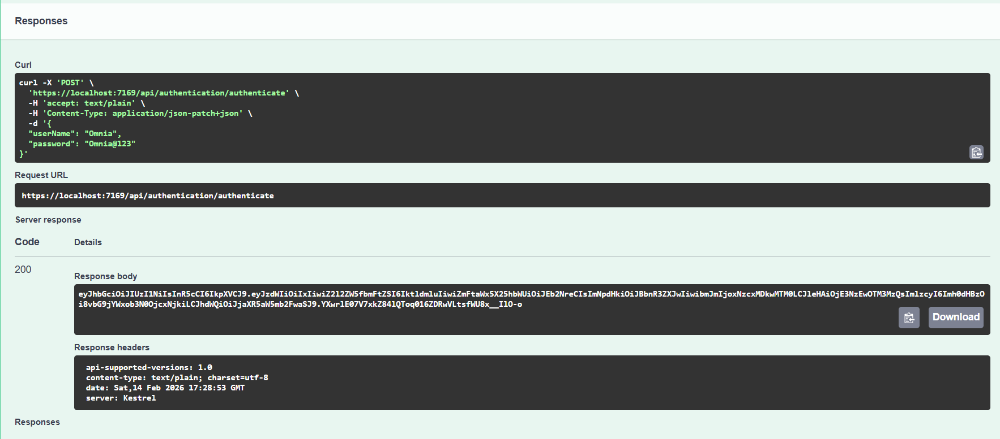
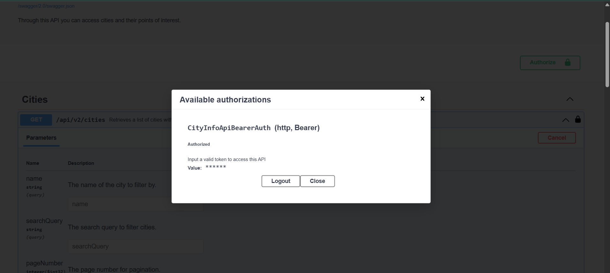
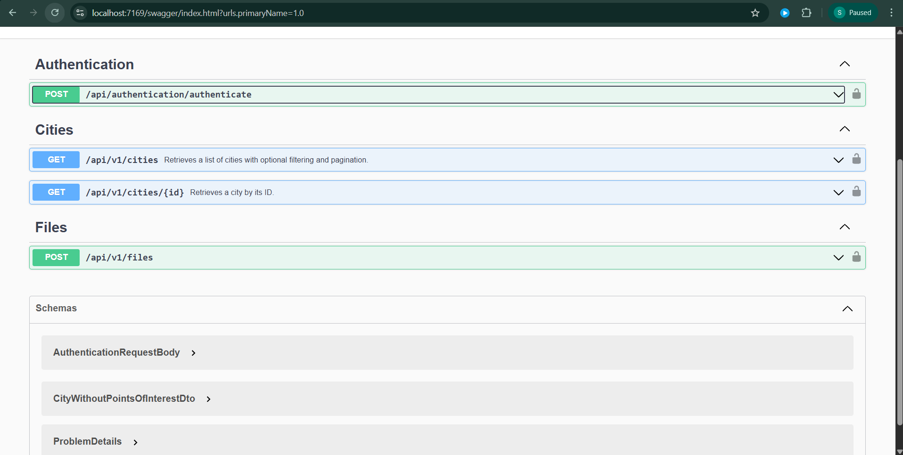
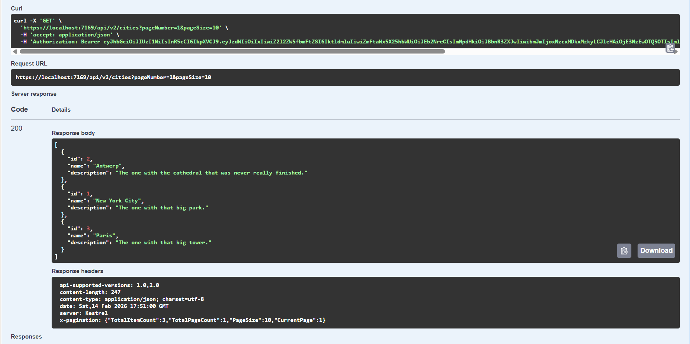

# 🌍 CityInfo.VersionedAPI

A production-style ASP.NET Core Web API demonstrating API versioning, JWT authentication, Entity Framework Core integration, Swagger documentation, and structured logging with Serilog.

---

## 🚀 Features

- API Versioning (v0.1, v1, v2)
- RESTful endpoints
- JWT Authentication
- Entity Framework Core with SQLite
- Swagger / OpenAPI documentation
- Structured logging using Serilog
- Clean controller-based architecture

---

## 🛠 Tech Stack

- .NET 8
- ASP.NET Core Web API
- Entity Framework Core
- SQLite
- Swagger (OpenAPI)
- Serilog

---

## 📦 API Versions Overview

### 🔹 Version 0.1
- Files endpoint

### 🔹 Version 1
- Cities
- Specifications
- Files

### 🔹 Version 2
- Cities
- Points of Interest

---

## ▶️ Running the Project Locally

### 1️⃣ Clone the repository
2️⃣ Restore packages
dotnet restore
3️⃣ Apply database migrations
dotnet ef database update
4️⃣ Run the project
dotnet run
5️⃣ Open Swagger UI
https://localhost:7169/swagger

<h2>📸 Screenshots</h2>

<h3>Authentication & Authorization</h3>

<h3>Swagger</h3>

<h3>Example Response</h3>

